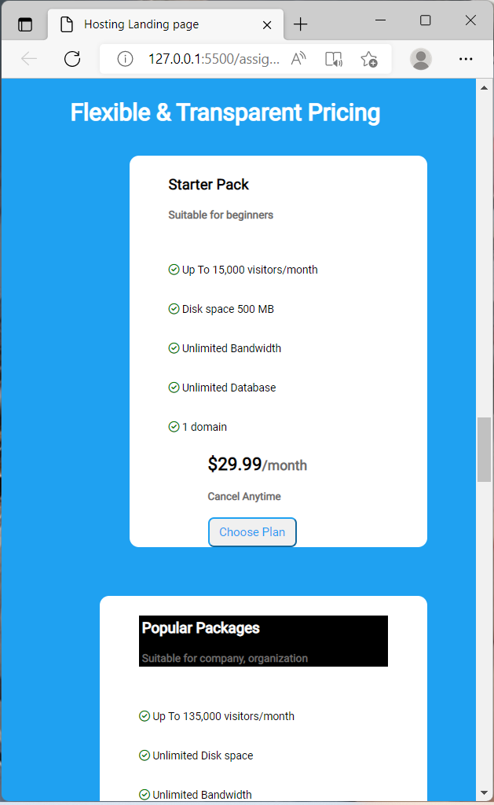

# Project Title : Hosting Landing Page

## About 

This project was to build a Hosting Landing Page with few images and texts placed in row direction.

## What Did I learn

I learnt to write CSS and HTML on my own to this project.
Eventhough it took me few hours to complete the project it improved my knowledge in CSS and HTML.

## Time Taken To Finish The project

Around 7 Hours.

## Screen Resolution

1920 * 1080

## Project Final Look

